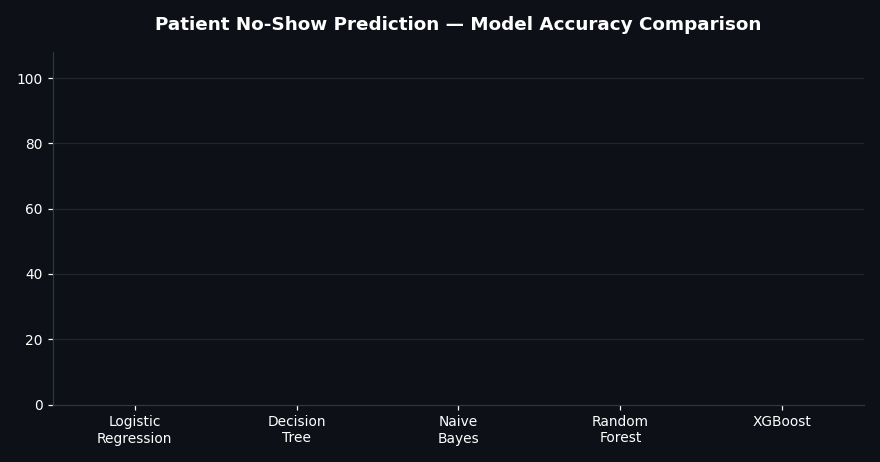

<div align="center">


<a href="https://linkedin.com/in/nagaram-kiran-kumar-4810401b9">
  
</a>


</div>

## 🎯 About Me

```python
class DataAnalyst:
    def __init__(self):
        self.name = "Kiran Kumar Nagaram"
        self.education = "B.Tech - AI & Data Science (CGPA: 8.6)"
        self.role = "Data Analyst | Machine Learning"
        self.current_location = "Bommonahalli, Bangalore, Karnataka, India"
        self.native_place = "Konduru Village, Tada Mandal, Tirupati District, Andhra Pradesh, India"
        self.skills = ["Python", "SQL", "Power BI", "Excel", "Scikit-learn"]
        self.currently_learning = ["Power BI", "Advanced Excel"]

    def key_achievements(self):
        return {
            "patient_no_show_model": "95.47% accuracy (XGBoost)",
            "house_price_model": "R\u00b2 = 0.89",
            "sarcasm_detection_study": "90.25% avg accuracy, validated (SPSS T-test)"
        }

    def status(self):
        return "\U0001F7E2 Open to Data Analyst / Data Science opportunities"

me = DataAnalyst()
```

<br/>

## 🛠️ Tech Stack

<sub>💡 Hover over any badge to see how I used it — click it to jump to the proof</sub>

<br/><br/>

<div align="center">

**Languages & Query**

<a href="#proj-noshow" title="Used for end-to-end data analysis, cleaning, and machine learning across all 4 of my projects."></a>
<a href="#certs" title="Used for querying and managing relational databases. Backed by my Oracle SQL Certified Specialist certification."></a>

**Data Analysis & Visualization**

<a href="#proj-house" title="Used for data cleaning, wrangling, and feature engineering — e.g. property age and price-per-sqft in the House Price project."></a>
<a href="#proj-house" title="Used for numerical computations and array operations supporting data preprocessing before model training."></a>
<a href="#proj-house" title="Used to build static visualizations — correlation heatmaps and geospatial scatter plots in the House Price project."></a>
<a href="#proj-house" title="Used for statistical visualizations to uncover pricing trends and relationships between variables."></a>
<a href="#certs" title="Used for building interactive dashboards and BI reports to visualize and analyze data. Currently building hands-on proficiency."></a>
<a href="#certs" title="Used for spreadsheet-based data analysis, cleaning, and reporting. Backed by my Microsoft Excel certification."></a>
<a href="#proj-sarcasm" title="Used for statistical hypothesis testing (T-test) to validate Random Forest's accuracy advantage (p < 0.05) in the Sarcasm Detection study."></a>

**Machine Learning — Libraries**

<a href="#proj-noshow" title="Used to build, train, and evaluate regression and classification models across both major projects."></a>
<a href="#proj-noshow" title="Used as the top-performing classifier in the Patient No-Show project — 95.47% accuracy, outperforming 4 other models."></a>

**Machine Learning — Algorithms**

<a href="#proj-sarcasm" title="Used as a regressor (House Price, R²=0.89) and as the winning classifier in the Sarcasm Detection study (90.25% avg accuracy)."></a>
<a href="#proj-tasks" title="Used to build an interpretable classifier predicting customer purchase behavior from demographic and behavioral data."></a>
<a href="#proj-noshow" title="Used as a baseline classification benchmark in the Patient No-Show prediction study."></a>
<a href="#proj-noshow" title="Used as a probabilistic classification benchmark in the Patient No-Show prediction study."></a>
<a href="#proj-sarcasm" title="Used as a boosting-based classification benchmark against Random Forest in the Sarcasm Detection study."></a>
<a href="#proj-sarcasm" title="Used as a boosting-based classification benchmark against Random Forest in the Sarcasm Detection study."></a>

**Databases**

<a href="#certs" title="Used for relational database management and querying."></a>
<a href="#certs" title="Used for relational database querying. Backed by my Oracle Database SQL Certified Specialist certification."></a>

**Tools & Version Control**

<a href="https://github.com/kiran121103" title="Used for version control and hosting my project code."></a>
<a href="#proj-tasks" title="Used for interactive Python development across my 5-task data analytics series."></a>
<a href="#proj-tasks" title="Used as a cloud-based Python notebook environment for ML experimentation without local setup."></a>

</div>

<br/>

## 🚀 Featured Projects

<a id="proj-noshow"></a>
<table>
<tr>
<td width="50%" valign="top">

### 🏥 Patient No-Show Prediction
Benchmarked 5 classification models (XGBoost, Random Forest, Logistic Regression, Naive Bayes, Decision Tree) to predict appointment no-shows.

**🎯 95.47% accuracy** with XGBoost — used to improve scheduling efficiency.

`Python` `Pandas` `Matplotlib` `Scikit-learn` `XGBoost`

</td>
<td width="50%" valign="top">

<a id="proj-sarcasm"></a>
### 🎭 Sarcasm & Irony Detection
Comparative ML study: Random Forest vs. AdaBoost, Logistic Regression, Naive Bayes, Gradient Boosting across 4 domains.

**🎯 90.25% avg accuracy**, validated via T-test in SPSS (p < 0.05).

`Python` `Random Forest` `AdaBoost` `Gradient Boosting` `SPSS`

</td>
</tr>
<tr>
<td width="50%" valign="top">

<a id="proj-house"></a>
### 🏠 House Price Prediction
Analyzed a 21,613-record housing dataset with 21 features, benchmarking four regression models.

**🎯 R² = 0.89** — living area, grade, and location as top price drivers.

`Python` `Pandas` `Matplotlib` `Seaborn` `Scikit-learn`

</td>
<td width="50%" valign="top">

<a id="proj-tasks"></a>
### 📊 Data Analytics Task Series
5 end-to-end Python tasks — EDA, a decision tree classifier, sentiment analysis, and accident hotspot mapping.

`Python` `Jupyter Notebook` `EDA` `Data Cleaning`

</td>
</tr>
</table>

<br/>

## 📊 GitHub Stats

<div align="center">


</div>

## 🏆 Trophies

<div align="center">


</div>

<br/>

## 📈 Model Performance in Action

<div align="center">



<sub>Real results from my Patient No-Show Prediction project — five ML models benchmarked, XGBoost winning at 95.47% accuracy</sub>

</div>

<br/>

## 🧠 Soft Skills

<div align="center">


</div>

<br/>

## 🗣️ Languages I Speak

| Language | Proficiency |
|---|---|
| Telugu | Full Professional |
| English | Professional Working |
| Tamil | Limited Working |

<br/>

<a id="certs"></a>
## 📜 Certifications

- 🎓 Career Essentials in Data Analysis — Microsoft & LinkedIn
- 🎓 Database SQL Certified Specialist — Oracle
- 🎓 Introduction to Machine Learning — Udemy
- 🎓 Introduction to Data Analysis using Microsoft Excel — Coursera

<br/>

## 🤝 Connect With Me

<div align="center">

[](https://linkedin.com/in/nagaram-kiran-kumar-4810401b9)
[](https://mail.google.com/mail/?view=cm&fs=1&to=nagaramkirankumar1211@gmail.com)
[](https://youtube.com/@nagaramkirankumar1776)

</div>


